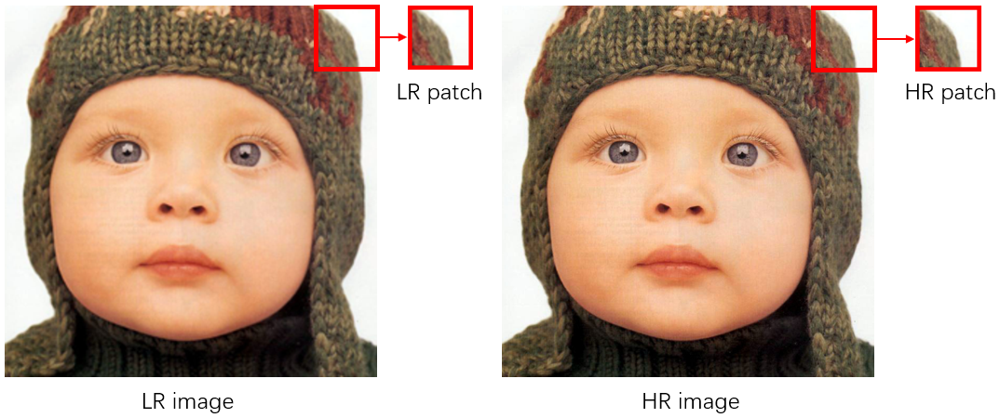
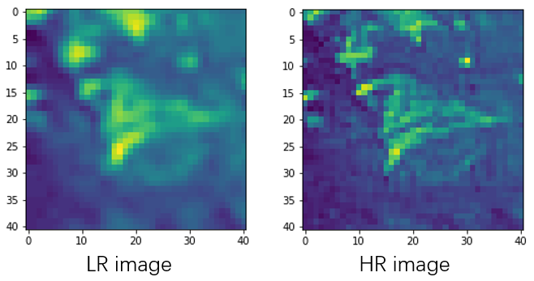

# Super Resolution

## DataFlow

**Note**: the size of `test_HR` and `test_LR` should match the input and output of the model. Some models (SRCNN) use bicubic resize of the low-resolution image as input, which has the same size of high-resolution. While others (FSRCNN) use `x` scale downsampling low-resolution image as input, the size of which should be able to divided evenly by the correspond high-resolution image by the up-scale factor.

### Patch pair

This method should first build `train_HR` and `train_LR` patch correspondingly using `data_aug.py`, which will prepare image (like crop to 41x41) as patch pair:



In the `configs/model.yml` file:

```yml
use_h5py: False
train_HR_dir: path_to_train_HR
train_LR_dir: path_to_train_HR
test_HR_dir: path_to_test_HR
test_LR_dir: path_to_test_LR
```

**Note**: the size of `train_HR` and `train_LR` should match input and output of the model.

### H5py

This method should first build `train_HR` and `train_LR` patch correspondingly using `data_aug.py`, which will prepare image (like crop to 41x41) as patch pair. By setting `use_h5py=True`, you can save the patch above to single `.h5` file with key `lr` and `hr` respectively. This method is recommended to hardware with large RAM.

In the `configs/model.yml` file:

```yml
use_h5py: True
h5py_input: path_to_h5_file
test_HR_dir: path_to_test_HR
test_LR_dir: path_to_test_LR
```

**Visualization**:

```python
import h5py
import matplotlib.pyplot as plt
f = h5py.File('test.h5','r')
f.keys()
plt.imshow(f['lr'][1])
plt.imshow(f['hr'][1])
```



### Dataloader

Using traditional data processing flow in Pytorch but crop image patch randomly.

In the `configs/model.yml` file:

```yml
use_h5py: False
origin_HR_dir: path_to_origin_HR
train_HR_dir: path_to_train_HR
train_LR_dir: path_to_train_HR
test_HR_dir: path_to_test_HR
test_LR_dir: path_to_test_LR
```

This method will **generate whole image using with augmentation**, and then crop patch correspondingly during training.

## Methods

### Bibubic

| Dataset  | Scale              | PSNR                        | SSIM                           | IFC                      |
| -------- | ------------------ | --------------------------- | ------------------------------ | ------------------------ |
| Set5     | x2<br />x3<br />x4 | 33.64<br />30.39<br />28.42 | 0.9292<br />0.8678<br />0.8101 | 5.72<br />3.45<br />2.28 |
| Set14    | x2<br />x3<br />x4 | 30.22<br />27.53<br />25.99 | 0.8683<br />0.7737<br />0.7023 | 5.74<br />3.33<br />2.18 |
| BSD100   | x2<br />x3<br />x4 | 29.55<br />27.20<br />25.96 | 0.8425<br />0.7382<br />0.6672 |                          |
| Urban100 | x2<br />x3<br />x4 | 26.66<br />24.64<br />23.14 | 0.8408<br />0.7353<br />0.6573 | 5.72<br />-<br />2.27    |

### SRCNN(2014)

paper:

- [Learning a Deep Convolutional Network for Image Super-Resolution(ECCV 2014)](https://link.springer.com/content/pdf/10.1007/978-3-319-10593-2_13.pdf)

- [Image Super-Resolution Using Deep Convolutional Networks (TPIAMI 2015)](https://arxiv.org/abs/1501.00092)

**Dataset prepare**: for 9-5-5, 91-image, train: 33x33, test: 21x21, stride: 14, for 9-1-5; for train 33x33, test: 17x17, for 9-5-5), see source code on http://mmlab.ie.cuhk.edu.hk/projects/SRCNN.html.

```bash
python data_aug.py --number 91 --upsampling bicubic --width 33 --height 33 --stride 14 -uf 2 \
                   --input F:\\cache\\data\\91-image\\HR --single_y --use_h5py --same_size \
                   --output F:\cache\data\data_for_SRCNN\\train_x2.h5
```

The best result of the paper is trained on 395,909 images from the ILSVRC 2013 ImageNet detection training partition.

I simply pick the first 1000 images from the validation dataset of ILSVRC 2012.

**Training**: 

```bash
python -m torch.distributed.launch --nproc_per_node=2 main.py --configs configs/srcnn.yaml
python main.py --configs configs/srcnn.yaml
```

**Resume**:

```bash
python -m torch.distributed.launch --nproc_per_node=2 main.py --configs configs/srcnn.yaml -r
python main.py --configs configs/srcnn.yaml -r
```

**Result**:

| Dataset   | Scale              | PSNR(91-images/ImageNet/paper)                               | SSIM(91-images/ImageNet/paper)                               |
| --------- | ------------------ | ------------------------------------------------------------ | ------------------------------------------------------------ |
| Set5      | x2<br />x3<br />x4 | 36.55/36.65/36.66/<br />32.18/32.45/32.75<br />30.34/30.36/30.49 | 0.9529/0.9532/0.9542<br />0.9041/0.9039/0.9090<br />0.8597/0.8604/0.8628 |
| Set14     | x2<br />x3<br />x4 | 32.33/32.35/32.45<br />28.84/29.06/29.28<br />27.37/27.41/27.49 | 0.9052/0.9049/0.9067<br />0.8156/0.8146/0.8215<br />0.7485/0.7496/0.7513 |
| BSD100    | x2<br />x3<br />x4 | 31.32/31.30/31.36<br />28.24/28.25/28.41<br />26.81/26.85/26.90 | 0.8869/0.8860/0.8977<br />0.7811/0.7802/0.7971<br />0.7084/0.7095/0.7184 |
| Urban 100 | x2<br />x3<br />x4 | 29.05/29.00/-<br />25.38/25.31/-<br />24.33/24.36/-          | 0.9004/0.8996/-<br />0.7969/0.7959/-<br />0.7143/0.7155/-    |

### FSRCNN(2016)

paper: [Accelerating the Super-Resolution Convolutional Neural Network（ECCV）](https://arxiv.org/abs/1608.00367)

Dataset prepare: 91-image dataset

Fine tune in paper: General-100 (I only train on 91-image dataset :)

For 2x, HR: 20x20, stride:2, LR: 10x10

For 3x, HR: 21x21, stride:3, LR: 7x7

For 4x, HR: 24x24, stride:4, LR: 6x6

Scale: 1.0 0.9 0.8 0.7 0.6, rotation: 0 90 180 270.

**Dataset prepare**:

```bash
python data_aug.py --number 91 --width 20 --height 20 --stride 2 -uf 2 \
				   --rotations 0 90 180 270 --scales 1.0 0.9 0.8 0.7 0.6 \
                   --input F:\\cache\\data\\91-image\\HR --single_y --use_h5py \
                   --output F:\cache\data\data_for_FSRCNN\\train_x2.h5
```

**Training**:

```bash
python -m torch.distributed.launch --nproc_per_node=2 main.py --configs configs/fsrcnn.yaml
python main.py --configs configs/fsrcnn.yaml
```

It takes a very long time to train.

For 2x, the number of dataset is 14632248.

For 3x, the number of dataset is 6473984.

For 4x, the number of dataset is 3546584.

| Scale              | Dataset  | PSNR(91-images/paper)                         | SSIM(91-images/paper)                               |
| ------------------ | -------- | --------------------------------------------- | --------------------------------------------------- |
| x2<br />x3<br />x4 | Set5     | 36.96/36.94<br />33.05/33.06<br />30.66/30.55 | 0.9551/0.9552<br />0.9128/0.9128<br />0.8651/0.8619 |
| x2<br />x3<br />x4 | Set14    | 32.48/32.54<br />29.33/29.37<br />27.43/27.50 | 0.9071/0.9080<br />0.8225/0.8231<br />0.7492/0.7509 |
| x2<br />x3<br />x4 | BSD100   | 31.42/31.73<br />28.47/28.55<br />26.93/26.92 | 0.8883/0.9064<br />0.7877/0.8123<br />0.7105/0.7378 |
| x2<br />x3<br />x4 | Urban100 | 29.30/-<br />26.61/-<br />24.50/-             | 0.9051/-<br />0.8150/-<br />0.7218/-                |

### VDSR(2016)

paper: [Accurate Image Super-Resolution Using Very Deep Convolutional Networks（CVPR）](http://arxiv.org/abs/1511.04587)

**Dataset prepare**. 91-image and Bsd300 training set, height:41, width:41, stride:41, scale: 1.0 0.7 0.5, rotation: 0 90 180 270, flip: 0 1 2 3, upscaleFactor: 2 3 4, single model, y channel in YCrCb space only.:

```bash
python data_aug.py --number 291 --upsampling nearest bicubic --width 41 --height 41 --stride 41 \
				   -uf 2 3 4 --scales 1.0 0.7 0.5 --rotations 0 90 180 270 --flips 0 1 2 3 \
				   --input /data/data/291-images/  --use_h5py --same_size --single_y \
				   --output /data/data/super_resolution/data_for_VDSR/train_index_y.h5
```

**Training**. 

```bash
python -m torch.distributed.launch --nproc_per_node=2 main.py --configs configs/vdsr.yaml
python main.py --configs configs/vdsr.yaml
```

**Resume**:

```bash
python -m torch.distributed.launch --nproc_per_node=2 main.py --configs configs/vdsr.yaml -r
python main.py --configs configs/vdsr.yaml -r
```

**Result**:

| Dataset  | Scale              | PSNR(291-images/paper)                        | SSIM(291-images/paper)                              |
| -------- | ------------------ | --------------------------------------------- | --------------------------------------------------- |
| Set5     | x2<br />x3<br />x4 | 37.46/37.53<br />33.67/33.66<br />31.33/31.35 | 0.9574/0.9587<br />0.9211/0.9213<br />0.8827/0.8838 |
| Set14    | x2<br />x3<br />x4 | 32.84/33.03<br />29.76/29.77<br />27.98/28.01 | 0.9110/0.9124<br />0.8314/0.8314<br />0.7669/0.7674 |
| BSD100   | x2<br />x3<br />x4 | 31.81/31.90<br />28.81/28.82<br />27.26/26.90 | 0.8942/0.8960<br />0.7970/0.7976<br />0.7242/0.7251 |
| Urban100 | x2<br />x3<br />x4 | 30.18/30.76<br />26.09/27.14<br />25.15/25.18 | 0.9165/0.9140<br />0.8358/0.8279<br />0.7504/0.7524 |

### ESPCN(2017)

paper: [Real-Time Single Image and Video Super-Resolution Using an Efficient Sub-Pixel Convolutional Neural Network（CVPR)](https://arxiv.org/abs/1609.05158)

Dataset prepare: 91-image：

For 2x, HR: 34x34, stride: 28, LR: 17x17

For 3x, HR: 51x51, stride: 42, LR: 17x17

For 4x, HR: 68x68, stride: 56, LR: 17x17

**Note**: stride $$(17-\sum mod(f,2))\times r$$  for HR and $$17-\sum mod(f,2)$$

**Dataset prepare**.

```bash
python data_aug.py --number 1000 --width 68 --height 68 --stride 56 -uf 4 \
				   --input /data/data/ImageNet_val/  --single_y --use_h5py \
				   --output /data/data/super_resolution/data_for_ESPCN/train_x4.h5
```

The paper use ImageNet 50,000 randomly selected images. 

For 2x, 100 images.

For 3x, 3000 images.

For 4x, 5000 images.

Both scales have around 300,000 patches of images.

**Training**. 

```bash
python -m torch.distributed.launch --nproc_per_node=2 main.py --configs configs/espcn.yaml
python main.py --configs configs/espcn.yaml
```

**Resume**:

```bash
python -m torch.distributed.launch --nproc_per_node=2 main.py --configs configs/espcn.yaml -r
python main.py --configs configs/espcn.yaml -r
```

**Result**:

| Dataset | Scale              | PSNR(91-images/paper/ImageNet/paper)                         | SSIM(91-images/paper/ImageNet/paper)                         |
| ------- | ------------------ | ------------------------------------------------------------ | ------------------------------------------------------------ |
| Set5    | x2<br />x3<br />x4 | 36.44/-/36.45/-<br />32.45/32.55/32.66/33.00<br />30.07/-/30.30/30.90 | 0.9522/-/0.9525/-<br />0.9036/-/0.9078/-<br />0.8483/-/0.8558/- |
| Set14   | x2<br />x3<br />x4 | 32.15/-/32.22/-<br />29.00/29.08/29.21/29.42<br />27.11/-/27.35/27.73 | 0.9037/-/0.9047/-<br />0.8147/-/0.8196/-<br />0.7396/-/07474/- |
| BSD200  | x2<br />x3<br />x4 | 31.13/-/31.22/-<br />28.20/28.26/28.36/28.52<br />26.71/-/26.82/27.06 | 0.8846/-/0.8863/-<br />0.7806/-/0.7851/-<br />0.7032/-/0.7086/- |

### DRCN(2016)

paper: [Deeply-Recursive Convolutional Network for Image Super-Resolution（CVPR）](https://arxiv.org/abs/1511.04491)

Dataset prepare: 91-image, 41x41, stride: 21, flip: 0 1, rotation: 0 90 180 270, upscaleFactor: 2 3 4, single model, scales: 1.0 0.7 0.5

**Dataset prepare**.

```bash
python data_aug.py --number 91 --width 41 --height 41 --stride 21 -uf 2 \
				   --rotations 0 90 180 270 --scales 1.0 0.7 0.5 --upsampling bicubic \
				   --input /data/data/91-images/data  --single_y --use_h5py \
				   --output /data/data/super_resolution/data_for_DRCN/train_x2.h5
```

**Training**.

```bash
python -m torch.distributed.launch --nproc_per_node=2 main.py --configs configs/drcn.yaml
python main.py --configs configs/drcn.yaml
```

**Resume**.

```bash
python -m torch.distributed.launch --nproc_per_node=2 main.py --configs configs/drcn.yaml -r
python main.py --configs configs/drcn.yaml -r
```

**Result**(DK how to train):

| Dataset  | Scale              | PSNR(91-images/paper)                 | SSIM(91-images/paper)                     |
| -------- | ------------------ | ------------------------------------- | ----------------------------------------- |
| Set5     | x2<br />x3<br />x4 | 34.99/37.63<br />-/33.82<br />-/31.53 | 0.9420/0.9588<br />-/0.9226<br />-/0.8854 |
| Set14    | x2<br />x3<br />x4 | 31.28/33.04<br />-/29.76<br />-/28.02 | 0.8918/0.9118<br />-/0.8311<br />-/0.7670 |
| BSD100   | x2<br />x3<br />x4 | 30.42/31.85<br />-/28.80<br />-/27.23 | 0.8709/0.8942<br />-/0.7963<br />-/0.7233 |
| Urban100 | x2<br />x3<br />x4 | -/30.75<br />-/27.15<br />-/25.14     | 0/0.9133<br />-/0.8276<br />-/0.7510      |

### DRRN(2017)

paper:  [Image super-resolution via deep recursive residual network（CVPR）](https://openaccess.thecvf.com/content_cvpr_2017/papers/Tai_Image_Super-Resolution_via_CVPR_2017_paper.pdf)

Dataset prepare: 91-image and BSD300 train set, 31x31, stride: 21, rotation: 0 90 180 270, flip: 0 1, upscaleFactor: 2 3 4, single model

**Dataset prepare**.

```bash
python data_aug.py --number 291 --width 31 --height 31 --stride 28 -uf 2 3 4 \
				   --rotations 0 90 180 270 --flip 0 1 2 --upsampling bicubic \
				   --input /data/data/291-images  --single_y --use_h5py \
				   --output /data/data/super_resolution/data_for_DRRN/train.h5
```

**Training**.

```bash
python -m torch.distributed.launch --nproc_per_node=2 main.py --configs configs/drrn.yaml
python main.py --configs configs/drrn.yaml
```

**Resume**.

```bash
python -m torch.distributed.launch --nproc_per_node=2 main.py --configs configs/drrn.yaml -r
python main.py --configs configs/drrn.yaml -r
```

**Result**.

| Dataset  | Scale              | PSNR(291-images/paper)                        | SSIM(91-images/paper)                               |
| -------- | ------------------ | --------------------------------------------- | --------------------------------------------------- |
| Set5     | x2<br />x3<br />x4 | 37.68/37.74<br />34.05/34.03<br />31.69/31.68 | 0.9586/0.9591<br />0.9248/0.9244<br />0.8890/0.8888 |
| Set14    | x2<br />x3<br />x4 | 33.04/33.23<br />29.87/29.96<br />28.16/28.21 | 0.9125/0.9136<br />0.8343/0.8349<br />0.7718/0.7720 |
| BSD100   | x2<br />x3<br />x4 | 31.97/32.05<br />28.92/28.95<br />27.37/27.38 | 0.8962/0.8973<br />0.8000/0.8004<br />0.7283/0.7284 |
| Urban100 | x2<br />x3<br />x4 | 31.49/31.23<br />27.66/27.53<br />25.48/25.44 | 0.9219/0.9188<br />0.8459/0.8378<br />0.7647/0.7638 |

### LapSRN(2016)


### RDN(2017)

**Training**

```bash
python -m torch.distributed.launch --nproc_per_node=2 main.py --configs configs/rdn.yaml
python main.py --configs configs/rdn.yaml
```

**Result**.

| Dataset  | Scale                      | PSNR(291-images/paper)                          | SSIM(91-images/paper)                                 |
| -------- | -------------------------- | ----------------------------------------------- | ----------------------------------------------------- |
| Set5     | x2<br />x3<br />x4<br />x8 | /38.30<br />34.48/34.78<br />/32.61<br />/27.23 | /0.9617<br />0.9273/0.9299<br />/0.8999<br />/0.7854  |
| Set14    | x2<br />x3<br />x4<br />x8 | /34.14<br />30.41/30.63<br />/28.93<br />/25.25 | /0.9235<br />0.8439/0.8477<br />/0.7894<br />/0.6505  |
| BSD100   | x2<br />x3<br />x4<br />x8 | /32.41<br />29.15/29.33<br />/27.80<br />/24.91 | /0.9025<br />0.8068/0.8107<br />/0.7436<br />/0.6032  |
| Urban100 | x2<br />x3<br />x4<br />x8 | /32.55<br />28.70/29.02<br />/26.85<br />/22.83 | /0.9324<br /> 0.8719/0.8695<br />/0.8089<br />/0.6374 |
| Manga109 | x2<br />x3<br />x4<br />x8 | /39.60<br />34.00/34.58<br />/31.45<br />/25.14 | /0.9791<br />0.9483/0.9502<br />/0.9187<br />/0.7994  |

### GLEAN(2021)

```
python -m torch.distributed.launch --nproc_per_node=2 main.py --configs configs/glean.yaml
python main.py --configs configs/glean.yaml
```


### RCAN

### WDSR

## Source

- [BaiduNetDisk](https://pan.baidu.com/s/1AHKdBOUO9rJ_JSYsqiTylQ ), code: scao 
